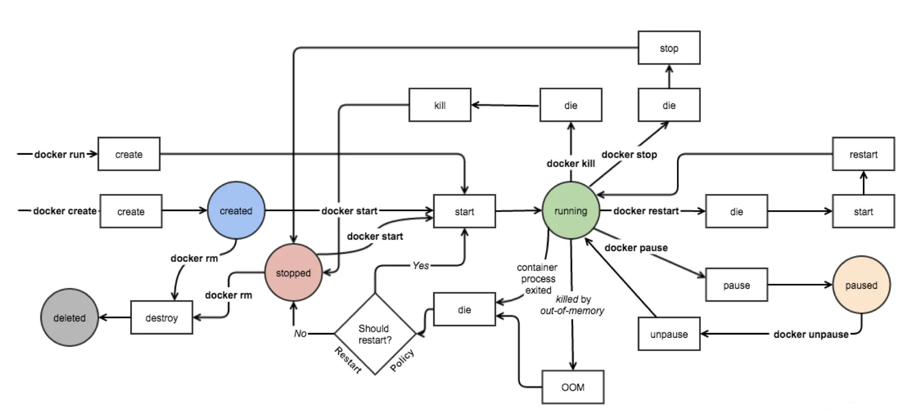

# Docker

> 一句话, docker大法好. 应用即容器.

## Docker组成

`镜像Image` `容器Container` `网络Network` `数据卷Volume`

### 镜像Image

可以理解为一个只读的文件包, 其中包含了**虚拟环境运行最原始文件系统的内容**

#### 命名规则

镜像的命名我们可以分成三个部分：`username`、`repository` 和 `tag`。

- `username`： 主要用于识别上传镜像的不同用户，与 GitHub 中的用户空间类似。
- `repository`：主要用于识别进行的内容，形成对镜像的表意描述。
- `tag`：主要用户表示镜像的版本，方便区分进行内容的不同细节

> username/repository:tag  
> // 没有username即表示为官方维护的镜像

### 容器Container

隔离虚拟环境的基础设施, 即隔离出来的虚拟环境.

#### 容器的生命周期



#### 组成

- 一个 Docker 镜像
-  一个程序运行环境
- 一个指令集合

### 网络Network

在容器间建立虚拟网络, 并与其他网络环境隔离。

另外，利用一些技术，Docker 能够在容器中营造独立的域名解析环境，这使得我们可以在不修改代码和配置的前提下直接迁移容器，Docker 会为我们完成新环境的网络适配。

#### 容器互联

要让一个容器连接到另外一个容器，我们可以在容器通过 `docker create` 或 `docker run` 创建时通过 `--link` 选项进行配置。

> ```bash
> # e.g.
> $ sudo docker run -d --name mysql -e MYSQL_RANDOM_ROOT_PASSWORD=yes mysql
> $ sudo docker run -d --name webapp --link mysql webapp:latest
> ```

### 数据卷Volume

为了保证数据的独立性，我们通常会单独挂载一个文件系统来存放数据，在 Docker 中，通过这几种方式进行数据共享或持久化的文件或目录，我们都称为**数据卷 ( Volume )**。

#### 数据管理

要将宿主操作系统中的目录挂载到容器之后，我们可以在容器创建的时候通过传递 `-v` 或 `--volume` 选项来指定内外挂载的对应目录或文件。

> ```bash
> # 直接进行映射
> # -v <host-path>:<container-path>
> # !必须使用绝对路径
> $ sudo docker run -d nginx -v /webapp/html:/usr/share/nginx/html
> ```

## Docker Engine

### 安装

```bash
# CentOS

$ sudo yum install yum-utils device-mapper-persistent-data lvm2
$
$ sudo yum-config-manager --add-repo https://download.docker.com/linux/centos/docker-ce.repo
$ sudo yum install docker-ce
```

### 启动服务

```bash
# 启动
$ sudo systemctl start docker
# 开机自启动
$ sudo systemctl enable docker
```

### 常用CLI命令

```bash
# 查看 docker client / server 的版本信息
$ docker version

# 查看 docker 更全面的信息
$ docker info

# 查看镜像
$ docker images

# 拉取镜像
$ docker pull <ImageName>

# 搜索镜像
$ docker search <ImageName>

# 镜像管理
$ docker inspect <ImageName>

# 镜像删除
$ docker rmi [<image name or id>]

# 创建容器
$ docker create <ImageName>
# 启动容器
$ docker start <ImageName id>

# 创建&启动容器
$ docker run <name or id> [-d]

# 停止容器
$ docker stop <name or id>
# 删除容器
$ docker rm <name or id>

# 执行容器内命令   <-i> 保持输入流 <-t> 形成伪终端
$ docker exec <-it>
```
